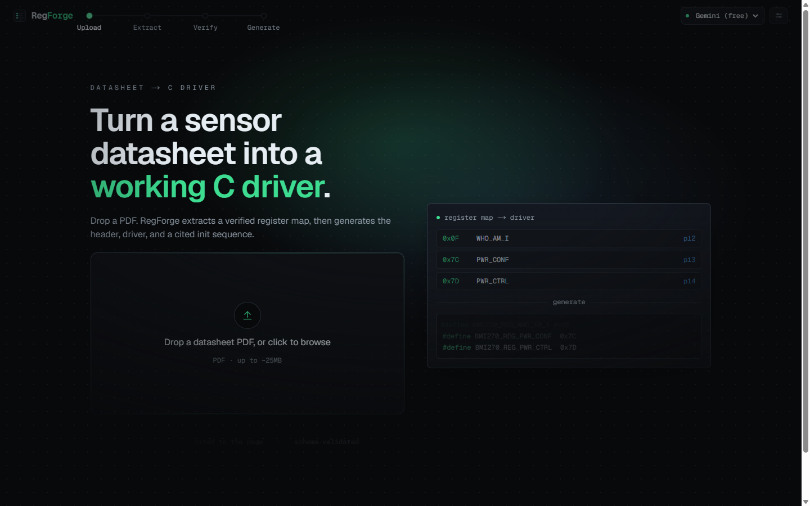
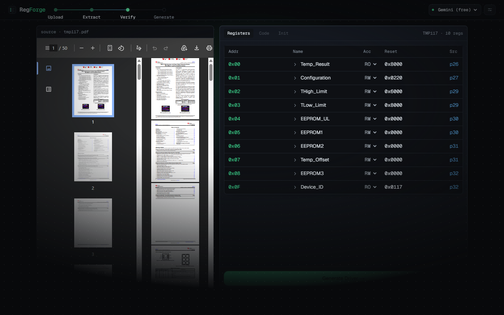
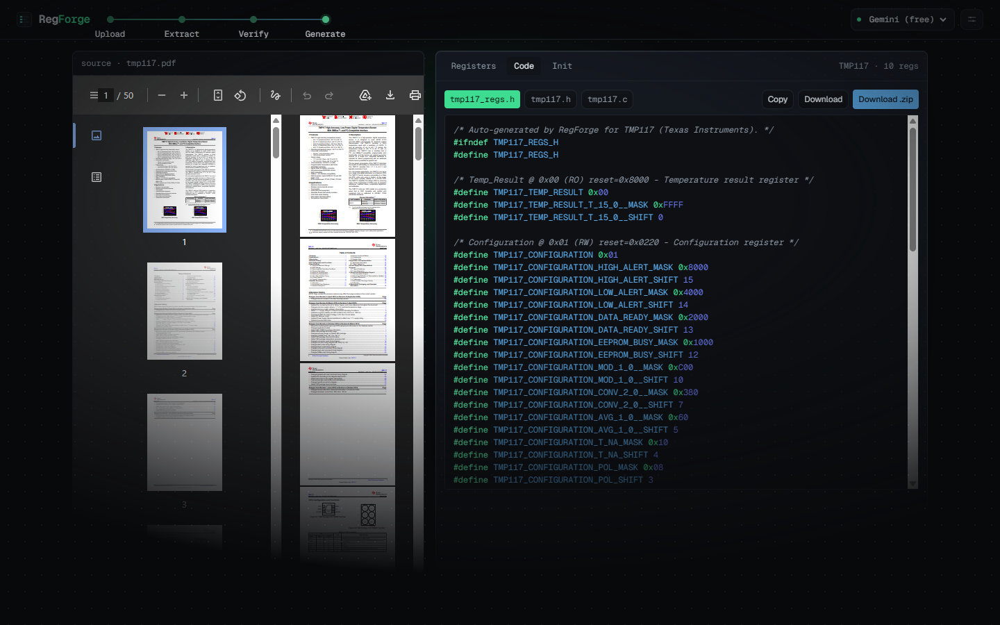
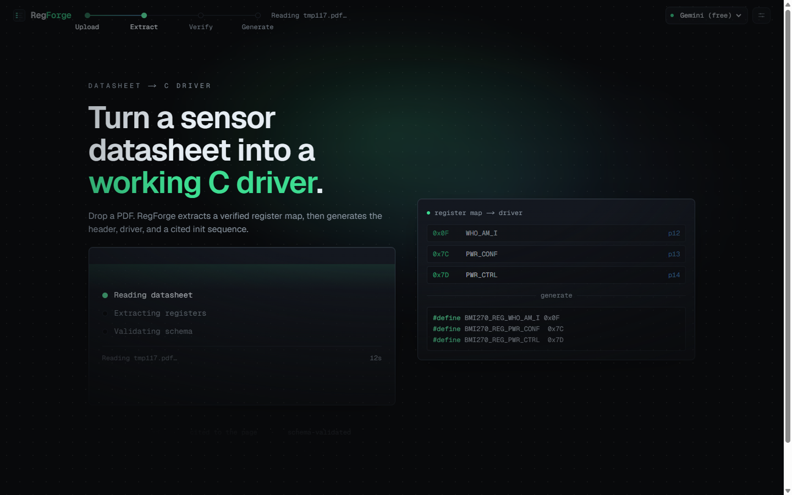
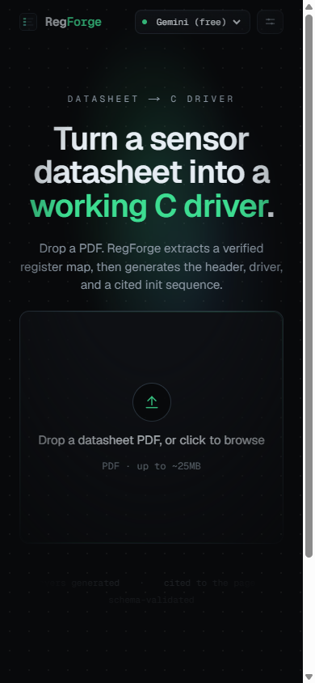

<div align="center">


# RegForge

**Turn a sensor datasheet PDF into a verified register map and a working, page-cited C driver.**

[](https://reg-forge.vercel.app)
&nbsp;


[**Live demo →**](https://reg-forge.vercel.app)

</div>

<br/>



<br/>

RegForge reads an I²C/SPI sensor datasheet with an LLM and extracts a **structured register
map**. You **verify and edit** that map inline (the trust checkpoint), then RegForge generates a
C header, a driver skeleton, and a **cited, ordered init sequence**, each step linked back to the
datasheet page it came from. The generated code comes from **deterministic templates**, not the
model, so it's never hallucinated.

It's tuned for clean, tabular sensor and peripheral chips like IMUs, temperature sensors, RTCs,
and power monitors. It is not built for multi-chapter MCU reference manuals.

---

## Why it's interesting

- **Live streaming extraction.** Extraction can take up to two minutes, so the server streams
  Server-Sent Events. Registers show up in the table as the model finds them, next to a phase
  stepper, a running count, and an elapsed timer, instead of a blank spinner.
- **Deterministic, schema-validated code generation.** The LLM only ever produces a register map,
  validated against a strict [Zod schema](src/lib/schema/registerMap.ts). All C output is built
  from pure [template functions](src/lib/generate/), so the code is reproducible and the model
  can't invent registers or values.
- **Every line is cited.** Each register and init step links back to the datasheet page it came
  from. Clicking a citation scrolls the source PDF to that page.
- **Multi-provider and BYOK.** Anthropic, OpenAI, and Gemini sit behind a single interface. Bring
  your own key (never stored or logged) or use the server default.
- **Accessible and responsive.** Real `tablist`/`tabpanel` semantics, `aria-live` narration of the
  extraction, keyboard generation (`⌘/Ctrl+Enter`), reduced-motion support, and a mobile layout
  that reflows to small screens instead of hiding features.
- **Tested.** 50 unit tests cover the schema contract, sanitization, template generation, and the
  extraction retry path. `tsc` runs strict and ESLint is clean.

---

## See it work

| Verify the extracted map | Generate cited C |
|---|---|
|  |  |

| Live streaming extraction | Mobile |
|---|---|
|  |  |

> The screenshots above are a real run against the [TI TMP117](https://www.ti.com/product/TMP117)
> temperature-sensor datasheet.

---

## How it works

```
          ┌─────────────┐   PDF + prompt    ┌──────────────┐
 Upload → │   /extract  │ ────────────────► │  LLM (stream)│
          └─────────────┘                   └──────┬───────┘
                 │  SSE: phase + registersFound     │ raw JSON
                 ▼                                   ▼
          ┌─────────────┐   strict parse     ┌──────────────┐
          │  Register   │ ◄───────────────── │  Zod schema  │
          │    table    │   (verify + edit)  │  validation  │
          └──────┬──────┘                    └──────────────┘
                 │ verified map
                 ▼
          ┌─────────────┐   deterministic    ┌──────────────┐
 Generate→│  /generate  │ ────────────────►  │  C templates │ → _regs.h
          └─────────────┘   (no LLM codegen) │  + init seq  │ → .c / .h
                                             └──────────────┘ → init sequence
```

**The trust model:** the LLM is confined to *reading* the datasheet into a validated data
structure. A human verifies it. Code is then generated by deterministic functions and cited back
to the source. The model never writes the C.

The four stages (**Upload · Extract · Verify · Generate**) are tracked by the lit stage rail
across the top of the UI.

---

## Tech stack

| Area | Choice |
|------|--------|
| Framework | Next.js 16 (App Router, Turbopack), React 19 |
| Language | TypeScript (strict) |
| Styling | Tailwind CSS v4, custom design tokens |
| Motion | Framer Motion + GSAP, all `prefers-reduced-motion`-guarded |
| LLM | Anthropic / OpenAI / Gemini behind one interface |
| Validation | Zod |
| Syntax highlighting | Shiki (custom brand theme, lazy-loaded) |
| Persistence (optional) | Supabase |
| Testing | Vitest |

---

## Getting started

```bash
npm install
cp .env.local.example .env.local   # then fill in the values
npm run dev                        # http://localhost:3000
```

**Environment variables** (`.env.local`):

- **At least one provider key** (used server-side for extraction and init-sequence reasoning):
  - `GEMINI_API_KEY`: Google Gemini (`gemini-2.5-flash`), the **free** path.
  - `ANTHROPIC_API_KEY`: Anthropic (`claude-sonnet-4-6`).
  - `OPENAI_API_KEY`: OpenAI (`gpt-4o`), **paid**.
- `NEXT_PUBLIC_SUPABASE_URL`, `SUPABASE_SERVICE_ROLE_KEY`, `NEXT_PUBLIC_SUPABASE_ANON_KEY`:
  **optional.** They enable persistence and the example gallery. Without them the app still works
  end to end; the gallery just stays empty.

### Providers

Pick the active provider from the dropdown in the top-right. Key resolution per request is:
**your BYOK key** (if supplied) → the server's `.env` default → a friendly typed error. Open the
settings popover next to the dropdown to paste your own key; BYOK keys are **never stored or
logged** and are sent only to the provider you chose for that one request.

| Provider  | Model               | Notes                                   |
|-----------|---------------------|-----------------------------------------|
| Gemini    | `gemini-2.5-flash`  | Free tier, native PDF. The demo path.   |
| Anthropic | `claude-sonnet-4-6` | Native PDF reading.                     |
| OpenAI    | `gpt-4o`            | Paid; base64 PDF file part.             |

### Optional: Supabase example gallery

Apply the schema in `supabase/migrations/0001_init.sql`, then run a few extractions and mark them
as examples:

```sql
update extractions set is_example = true
where device_name in ('BMI270', 'TMP117', 'DS3231');
```

---

## Scripts

```bash
npm run dev      # dev server (Turbopack)
npm run build    # production build
npm run test     # vitest suite (50 tests)
npm run lint     # eslint
```

---

## Project structure

```
src/
├─ app/
│  ├─ api/extract/      # SSE streaming extraction route
│  ├─ api/generate/     # deterministic C generation route
│  ├─ opengraph-image   # branded social card
│  └─ page.tsx          # client state machine (stage, map, files)
├─ components/          # AppShell, Cockpit, RegisterTable, CodeViewer, …
└─ lib/
   ├─ schema/           # the Zod register-map contract
   ├─ extract/          # PDF → validated map (with one retry)
   ├─ generate/         # map → C header / driver / init sequence (deterministic)
   ├─ llm/              # multi-provider abstraction (+ streaming seam)
   └─ motion/           # GSAP loader, variants, reduced-motion hook
```

---

## Status & roadmap

RegForge is a working demo, deployed and tested. Possible next steps:

- Wider chip coverage (multi-bank register files, paged maps).
- Per-field confidence surfaced from the model.
- More target languages (Rust `embedded-hal`, MicroPython).

---

## License

[MIT](LICENSE) © Piyush Nagpal

<div align="center">
<sub>Built with Next.js · <a href="https://reg-forge.vercel.app">reg-forge.vercel.app</a></sub>
</div>
